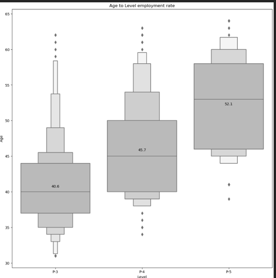
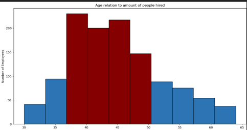
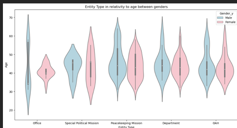
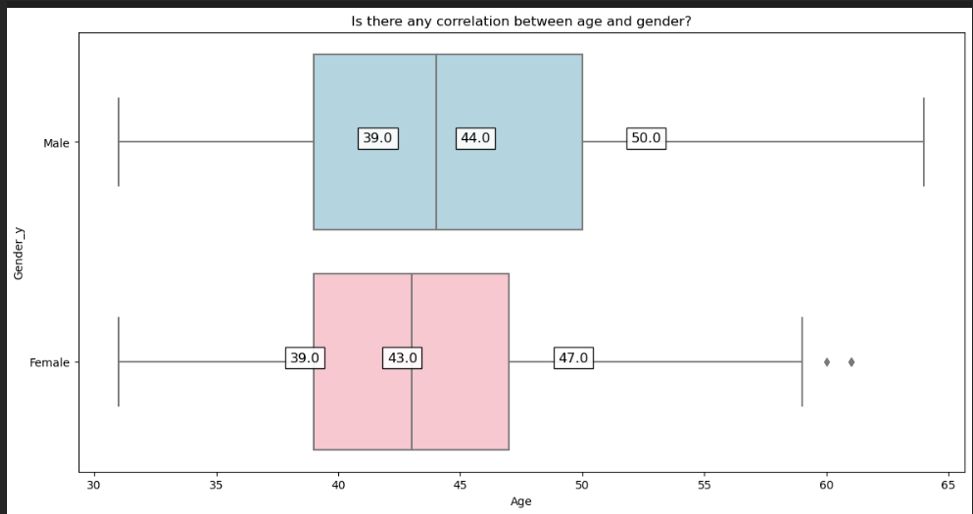
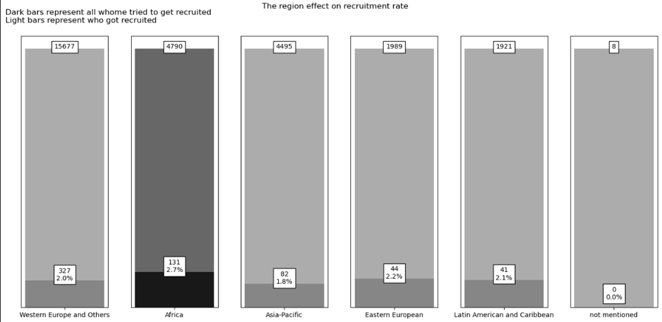

# Report on Recruitment Characteristics in the UN

## Introduction

This report analyses various visualizations to understand the characteristics of recruitment in the UN. The visualizations provide insights into age distribution, gender correlation, regional effects, and entity types in relation to recruitment rates.

## Age to Level Employment Rate

The box plot titled "Age to Level Employment Rate" shows the distribution of ages across three employment levels: P-3, P-4, and P-5. The median ages for these levels are 40.6, 45.7, and 52.1 years, respectively. This indicates that higher employment levels tend to have older employees, reflecting the experience and seniority required for these positions.

## Age Relation to Number of People Hired

The bar chart titled "Age relation to amount of people hired" illustrates the distribution of employees hired across different age groups. The peak hiring age is between 40-50 years, with the highest number of employees hired in the 40-45 and 45-50 age groups. This suggests that the UN tends to hire more experienced individuals within this age range.

## Entity Type in Relation to Age Between Genders

The violin plot titled "Entity Type in Relation to Age Between Genders" provides a detailed view of the age distribution for different entity types, separated by gender. The plot shows that the age distribution varies across entity types, with some entities having a wider age range than others. The gender representation is fairly balanced, with both males and females represented across all entity types.

## Correlation Between Age and Gender

The box plot titled "Is there any correlation between age and gender?" compares the ages of males and females. The median age for males is 44 years, while for females it is 43 years. The age distribution for both genders is similar, with a slight variation in the upper quartile. This indicates that there is no significant correlation between age and gender in the recruitment process.

## The Region Effect on Recruitment Rate

The bar chart titled "The Region Effect on Recruitment Rate" compares the recruitment rates across different regions. The recruitment rates are as follows:

- Western Europe and Others: 2.0%
- Africa: 2.7%
- Asia-Pacific: 1.8%
- Eastern European: 2.2%
- Latin American and Caribbean: 2.1%
- Not mentioned: 0.0%

The highest recruitment rate is in Africa (2.7%), while the lowest is in the Asia-Pacific region (1.8%). This suggests that regional factors may influence the recruitment process.

## Recommendations

Based on the analysis of the visualizations, the following recommendations are made:

1. **Targeted Recruitment**: Focus on recruiting individuals in the 40-50 age range, as this group has the highest hiring rate and likely possesses the necessary experience and skills.
2. **Regional Strategies**: Develop tailored recruitment strategies for regions with lower recruitment rates, such as the Asia-Pacific region, to improve diversity and representation.
3. **Gender Balance**: Continue to maintain a balanced gender representation across all entity types, ensuring equal opportunities for both males and females.
4. **Experience and Seniority**: Consider the experience and seniority required for higher employment levels, and ensure that recruitment processes reflect these requirements.

## Conclusion

The visualizations provide valuable insights into the characteristics of recruitment in the UN. By analyzing age distribution, gender correlation, regional effects, and entity types, we can develop targeted strategies to improve recruitment outcomes and ensure a diverse and experienced workforce.
